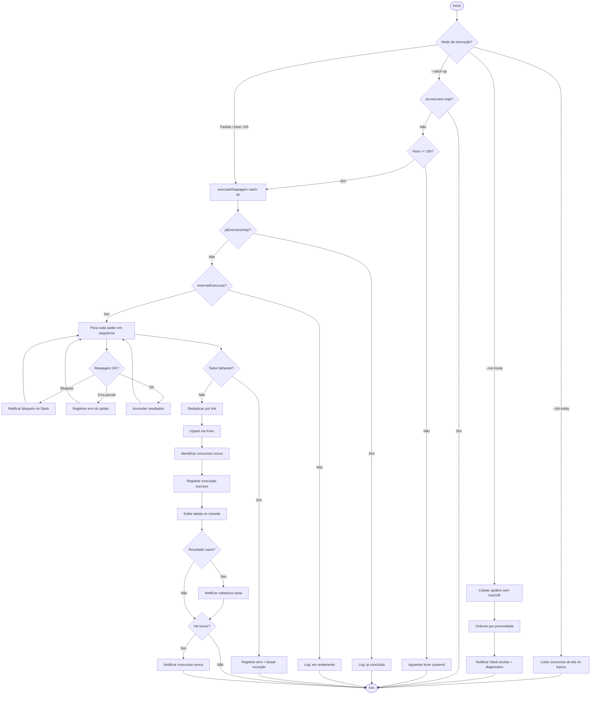
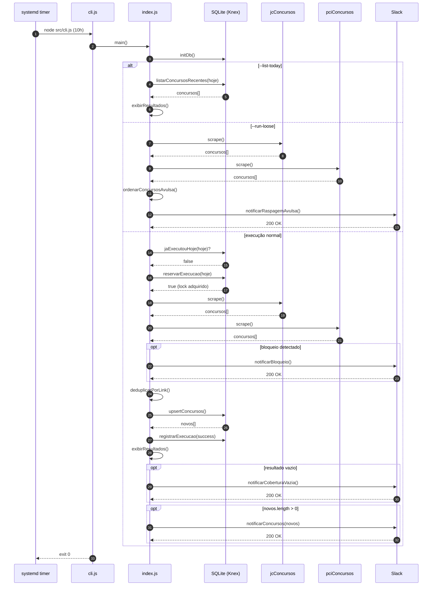

# Crawler de Concursos Públicos

Crawler modular em Node.js que monitora concursos públicos com inscrições abertas na região de **Capivari-SP** (raio de ~100 km). Os resultados são persistidos em SQLite via **Knex.js** e notificados no Slack quando há concursos **novos**, **bloqueios nas fontes** ou **cobertura vazia**. Há também um modo de **raspagem avulsa** para diagnóstico manual sem persistir no banco.

---

## Decisões técnicas

### Por que Node.js?

O runtime já oferece `fetch` nativo (baseado em undici) a partir da v18, eliminando dependências HTTP extras para as raspagens recorrentes. A execução via CLI encaixa bem com agendamento por systemd, sem precisar de servidor web nem container.

### Bibliotecas e abordagens

| Escolha | Motivo |
|---------|--------|
| **fetch nativo** (`httpClient.js`) | Cliente reutilizável dos spiders; raspagens diárias na mesma fonte se beneficiam de uma API simples e estável, sem axios. |
| **axios** (`slack.js`) | Webhook do Slack é requisição pontual (não recorrente); cliente com `httpsAgent` e `keepAlive: false` evita manter conexão aberta desnecessariamente. |
| **Cheerio** | Parsing de HTML server-side leve — extrai seletores CSS sem headless browser, reduzindo memória e superfície de ataque. |
| **Knex + SQLite** | Persistência local sem servidor de banco; query builder tipado facilita migrações e testes com `:memory:`. Adequado para volume baixo (dezenas de registros/dia). |
| **dotenv** | Configuração via `.env` sem expor segredos no código; carregamento centralizado em `env.js`. |
| **Jest** | Testes unitários com cobertura total; `unstable_mockModule` permite mockar ESM nativo. |

### Arquitetura modular

- **Spiders independentes** — cada fonte (`jcConcursos`, `pciConcursos`) é um módulo com interface `{ name, scrape }`. Falha em uma fonte não aborta a outra.
- **Orquestrador** (`src/index.js`) — deduplica, persiste, decide notificações e controla execução diária.
- **Helpers dos spiders** (`spiderHelpers.js`) — fetch centralizado, detecção de bloqueio anti-bot e montagem dos objetos de concurso.
- **Camada de segurança** — whitelist de domínios (`pertenceWhitelist`) bloqueia SSRF antes de qualquer fetch; links extraídos passam por `normalizarLinkSeguro`.
- **Detecção de bloqueios** — HTML das fontes é inspecionado por padrões de captcha/Cloudflare em `spiderHelpers.js`; alertas vão ao Slack com o tipo de bloqueio.
- **Raspagem avulsa** (`looseScrape.js`) — modo de diagnóstico que ordena resultados por proximidade e envia relatório completo ao Slack, sem gravar no banco.
- **Agendamento systemd** — timer às 10h + catch-up no boot; mais confiável que cron em máquina pessoal que pode estar desligada.

---

## Funcionalidades

| Módulo | Responsabilidade |
|--------|------------------|
| **Spiders** (`jcConcursos`, `pciConcursos`) | Raspagem de sites de concursos, filtro geográfico e validação de links |
| **Spider helpers** (`spiderHelpers.js`) | Fetch seguro, detecção de bloqueio (`BloqueioFonteError`) e normalização dos registros |
| **Banco SQLite + Knex** (`db.js`) | Persistência via query builder, controle de execução diária e lock contra corridas |
| **Slack** (`slack.js`) | Notificação de concursos inéditos, bloqueios, cobertura vazia e raspagem avulsa |
| **Geo filter** (`geoFilter.js`) | Cidades-alvo, detecção de escolaridade, headers HTTP, normalização de texto e fuso horário |
| **Raspagem avulsa** (`looseScrape.js`) | Ordenação por proximidade e diagnóstico de falhas para o modo `--run-loose` |
| **Segurança** (`security.js`, `httpClient.js`) | Whitelist de domínios, sanitização e limites HTTP |
| **Agendamento** (systemd) | Execução diária às 10h + catch-up no boot |

### O que o sistema faz

1. **Raspagem diária** — consulta PCI Concursos (Sudeste) e JC Concursos em busca de vagas em SP.
2. **Filtro geográfico** — mantém apenas concursos de cidades num raio de ~100 km de Capivari.
3. **Detecção de escolaridade** — infere o nível (fundamental, médio, técnico, superior) a partir do texto do edital.
4. **Deduplicação** — remove duplicatas pelo link do concurso.
5. **Persistência** — grava/atualiza registros em `data/concursos.db`.
6. **Notificação seletiva** — envia ao Slack concursos novos, alertas de bloqueio (captcha, Cloudflare, etc.) e aviso quando nenhum concurso é encontrado.
7. **Controle de execução** — impede mais de uma raspagem bem-sucedida por dia; lock com expiração de 30 min.
8. **Catch-up no boot** — se o PC ligar após as 10h e a raspagem do dia não rodou, executa automaticamente.

### Raspagem avulsa (`--run-loose`)

Modo de diagnóstico manual, distinto da raspagem diária:

| Aspecto | Raspagem diária | Raspagem avulsa |
|---------|-----------------|-----------------|
| Lock diário | Respeita | Ignora |
| Persistência no SQLite | Sim | Não |
| Notificação Slack | Somente concursos **novos** | **Todos** os encontrados + diagnóstico |
| Ordenação | Por ordem de coleta | Por proximidade a Capivari e escolaridade |

---

## Segurança

Auditoria focada em vetores que poderiam comprometer o computador local (SSRF, injeção, execução arbitrária, path traversal).

### Domínios permitidos

- `jcconcursos.com.br` / `www.jcconcursos.com.br`
- `pciconcursos.com.br` / `www.pciconcursos.com.br`

---

## Arquitetura

```
index.js                   # Re-export de src/index.js (compatibilidade)
scripts/
├── install-cron.sh        # Instala units systemd (npm run cron:install)
└── limpar-banco.js        # Limpa concursos e cron_runs (npm run db:clear)
src/
├── cli.js                 # Ponto de entrada (systemd / npm start)
├── index.js               # Orquestrador principal
├── config/env.js          # Variáveis de ambiente (.env)
├── database/
│   ├── db.js              # Operações de persistência (Knex)
│   ├── knex.js            # Fábrica de conexão
│   └── schema.js          # Definição das tabelas
├── services/slack.js      # Notificações Slack
├── spiders/
│   ├── jcConcursos.js
│   └── pciConcursos.js
└── utils/
    ├── geoFilter.js
    ├── httpClient.js
    ├── looseScrape.js
    ├── security.js
    └── spiderHelpers.js
systemd/                   # Templates das units user (timer, service, catch-up)
```

---

## Fluxograma do processo



---

## Diagrama de sequência



---

## Passo a passo

### 1. Pré-requisitos

- Node.js 18+
- Linux com systemd (para agendamento automático)
- Webhook do Slack (opcional, para notificações)

### 2. Instalação

```bash
git clone <repo-url> crawler-concursos
cd crawler-concursos
npm install
```

### 3. Configuração

Copie `.env.example` para `.env` e ajuste os valores:

```bash
cp .env.example .env
```

```env
SLACK_WEBHOOK_URL=https://hooks.slack.com/services/T00/B00/xxxxxxxxxxxxxxxxxxxxxxxx
TIMEZONE=America/Sao_Paulo
```

| Variável | Obrigatória | Descrição |
|----------|-------------|-----------|
| `SLACK_WEBHOOK_URL` | Não | Webhook do Slack; se ausente, notificações são ignoradas |
| `TIMEZONE` | Não | Fuso IANA; padrão `America/Sao_Paulo` |

### 4. Execução manual

```bash
# Raspagem imediata (respeita lock diário)
npm start

# Listar concursos gravados hoje
node src/cli.js --list-today

# Verificar catch-up (boot)
node src/cli.js --catch-up

# Raspagem avulsa — diagnóstico sem gravar no banco
npm run run:loose

# Limpar todos os registros do banco (requer confirmação)
npm run db:clear -- --yes
```

### 5. Agendamento automático (systemd)

```bash
npm run cron:install
```

Isso instala:

- **Timer** — dispara às 10h todos os dias
- **Catch-up** — roda ao ligar o PC se passou das 10h e ainda não executou

Para o timer funcionar sem login:

```bash
loginctl enable-linger "$USER"
```

Logs em `data/cron.log`.

### 6. Testes

```bash
npm test
```

A suíte Jest cobre **100%** de statements, branches, functions e lines. Relatório HTML em `coverage/lcov-report/index.html`.

---

## Comandos disponíveis

| Comando | Descrição |
|---------|-----------|
| `npm start` | Executa raspagem diária (via `src/cli.js`) |
| `npm run run-once` | Alias de `npm start` |
| `npm run run:loose` | Raspagem avulsa — sem lock, sem persistência, notifica tudo no Slack |
| `npm run cron:install` | Instala units systemd user |
| `npm run db:clear -- --yes` | Remove todos os registros de `concursos` e `cron_runs` |
| `npm test` | Testes com cobertura |
| `npm run test:watch` | Testes em modo watch |

---

## Cidades monitoradas

Capivari, Piracicaba, Campinas, Sorocaba, Indaiatuba, Americana, Limeira, Sumaré, Hortolândia, Itu, Jundiaí, Rio Claro, Santa Bárbara d'Oeste, Laranjal Paulista, Tietê, Porto Feliz, Tatuí, Salto, São Pedro, Rafard, Elias Fausto.

---

## Licença

ISC
